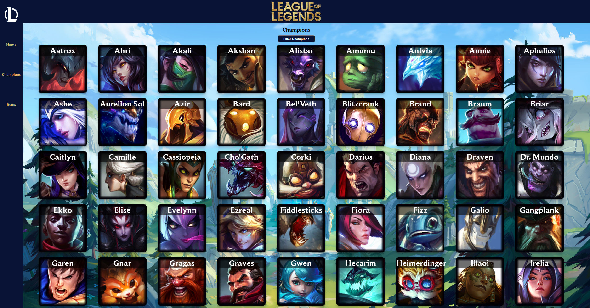
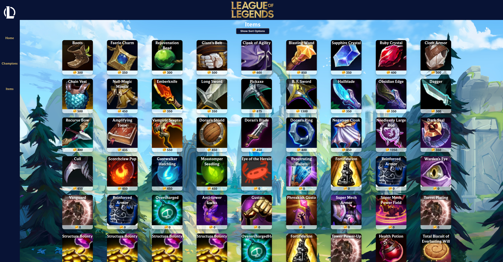

# League of Legends App

### <a href="https://jordaneckfordleagueoflegends.netlify.app/">View the live app</a>

League of Legends is a multiplayer online battle arena (MOBA) game in which the player controls a character ("champion") with a set of unique abilities from an isometric perspective. As of 2023, there are over 160 champions available to play.

 

## What is this app?

This app accesses the <a href="https://developer.riotgames.com/docs/lol">free Riot Games API</a> for League of Legends and displays this for the user.
 
Users can search through champions, sort them by specific classes and see in-depth details for the chosen champion. The in-depth details include the champions different skins, their lore, abilities, and what stats they have.
 
Users can also view the League of Legends shops items where they can sort them by current / legacy, and also sort them based on what specific properties they increase.

## Tech Stack:

- [![React][React.js]][React-url]
- [![Javascript][Javascriptimg]][Javscript-url]
- [![React-Router][ReactRouterimg]][ReactRouter-url]
- [![Netlify][Netlifyimg]][Netlify-url]
- ![CSS][CSS]

### Instructions on cloning and demo'ing:

- Copy the GitHub clone link (https://github.com/JordanEckford/league-of-legends.git)
- Navigate to the desired file location in your terminal and run
  > git clone https://github.com/JordanEckford/league-of-legends.git
- Navigate into the newly created folder

  > cd nc-news-app

- To install all of the dependencies required to run the files, run:

  > npm install

- You can run and test out this project locally by running the below:

  > npm run dev

- Open the link in the browser

[React.js]: https://img.shields.io/badge/React-20232A?style=for-the-badge&logo=react&logoColor=61DAFB
[React-url]: https://reactjs.org/
[Javascriptimg]: https://img.shields.io/badge/JavaScript-F7DF1E?style=for-the-badge&logo=javascript&logoColor=black
[Javscript-url]: https://www.javascript.com
[ReactRouterimg]: https://img.shields.io/badge/React_Router-CA4245?style=for-the-badge&logo=react-router&logoColor=white
[ReactRouter-url]: https://reactrouter.com/en/main
[Netlifyimg]: https://img.shields.io/badge/Netlify-00C7B7?style=for-the-badge&logo=netlify&logoColor=white
[Netlify-url]: https://www.netlify.com
[CSS]: https://img.shields.io/badge/CSS-239120?&style=for-the-badge&logo=css3&logoColor=white
